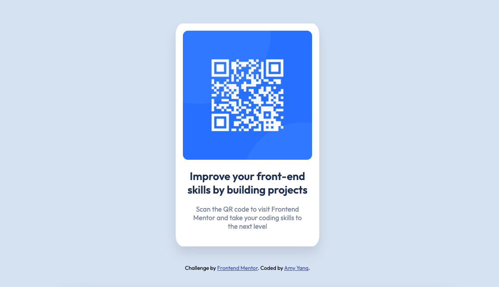

# Frontend Mentor - QR code component solution

This is a solution to the [QR code component challenge on Frontend Mentor](https://www.frontendmentor.io/challenges/qr-code-component-iux_sIO_H). 

## Overview

### Links

Demo: [https://hui-qr-code.netlify.app/]

## My process

- Figma for images style check
- style-guide for css coding
- dev tools for responsive check

### Built with

- Figma
- CSS custom properties
- Flexbox
- Mobile-first workflow

## Author

- Frontend Mentor - [@quanhuiyang](https://www.frontendmentor.io/profile/quanhuiyang)
